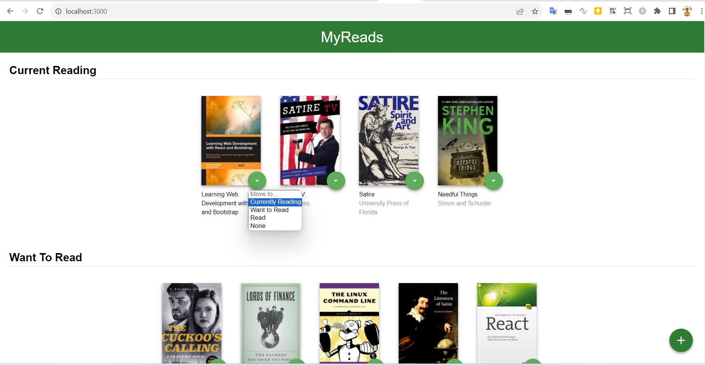
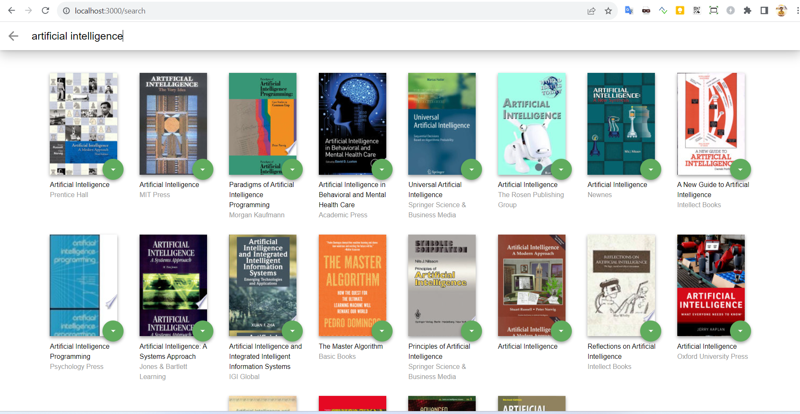

# MyReads Project

MyReads is a simple app that allows you to place books in one of three shelves or categories :
- Currently Reading
- Want to Read
- Read
It also allow you to search for books based on title and author.


## What You're Getting

```bash
├── public
│   ├── favicon.ico # React Icon, You may change if you wish.
│   └── index.html # DO NOT MODIFY
└── src
    ├── components
        ├── Book.js # Component for book item
        ├── BookShelves.js # Component for book shelve
        └── Shelf.js # Component for Shelf
    ├── icons # Helpful images for your app. Use at your discretion.
        ├── add.svg
        ├── arrow-back.svg
        └── arrow-drop-down.svg
    ├── App.css # Styles for your app. Feel free to customize this as you desire.
    ├── App.js # This is the root of your app. Contains static HTML right now.
    ├── BooksAPI.js # A JavaScript API for the provided Udacity backend. Instructions for the methods are below.
    ├── index.css # Global styles. You probably won't need to change anything here.
    └── index.js # You should not need to modify this file. It is used for DOM rendering only.

├── README.md - This file.
├── package.json # npm package manager file. It's unlikely that you'll need to modify this.
```

## Installation & Usage

To get started developing right away:

- install all project dependencies with `npm install`
- start the development server with `npm start`

The project can be viewed in the browser at:
- [http://localhost:3000](http://localhost:3000)

## Screenshots



